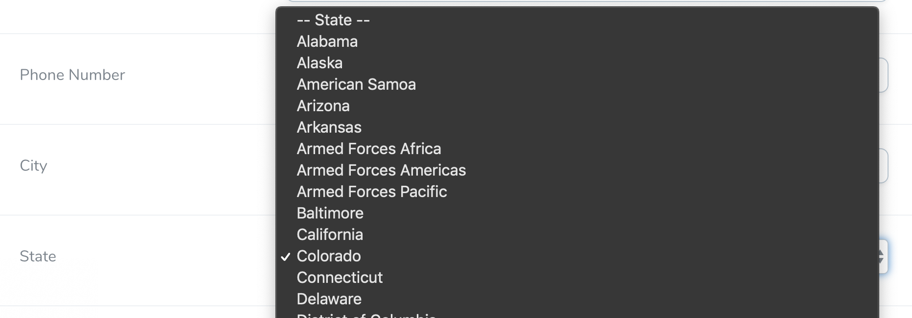

# Laravel Nova State/Territory Select Field



## Features

* Pre-populates a select dropdown field with all of the states in the United States 
* Works with the Place field
* Use the full state name or the 2 letter abbreviation
* Optionally include the US territories
* Add custom state abbreviations or state names

## Installation

To install this tool, use the installation code below:

```
composer require dniccum/state-select
```

## Code

To use the field, add the following code to your Nova resource. As this is a field, all of the default field properties can be applied.

```php
use Dniccum\StateSelect\StateSelect;

StateSelect::make('State')
```

## Options

### useFullNames

```php
StateSelect::make('State')
    ->useFullNames()
```

By default, this field uses the two-letter state abbreviations. Add this method if you would like to use and store the full state name.

### includeTerritories

```php
StateSelect::make('State')
    ->includeTerritories()
```

Adds the US territories and military territories as follows:

* American Samoa
* District of Columbia
* Federated States of Micronesia
* Guam
* Marshall Islands
* Northern Mariana Islands
* Palau
* Puerto Rico
* Virgin Islands
* Armed Forces Africa
* Armed Forces Americas
* Armed Forces Pacific

### customValues

```php
StateSelect::make('State')
    ->customValues([
        'Ontario',
        'Alberta'
    ])
```

If you would like to add any additional territories or provinces to the list, add them as an array.

**Note:** If you have used the `->useFullNames()` method, the values provided MUST be an associative array with the abbreviation first and the name second, like so:

```php
StateSelect::make('State')
    ->customValues([
        'ON' => 'Ontario',
        'AB' => 'Alberta'
    ])
```

## Credits

* [Doug Niccum](https://github.com/dniccum)

## License

The MIT License (MIT). Please see [License File](./LICENSE) for more information.